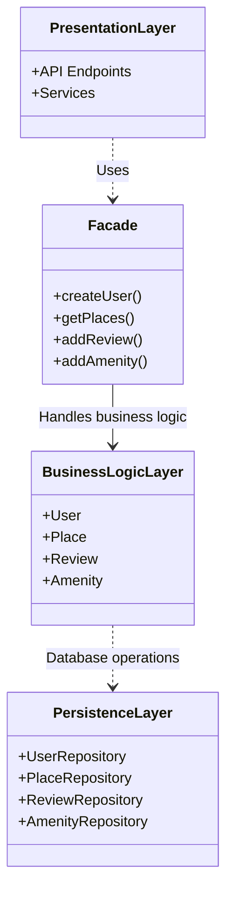
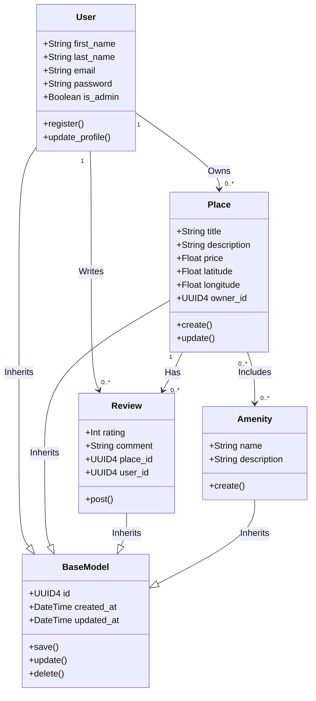
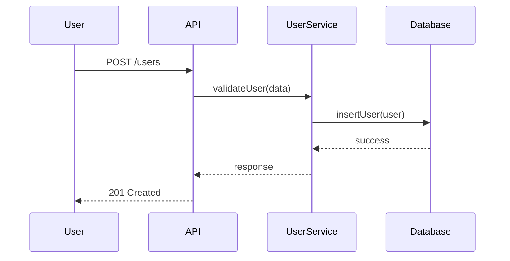
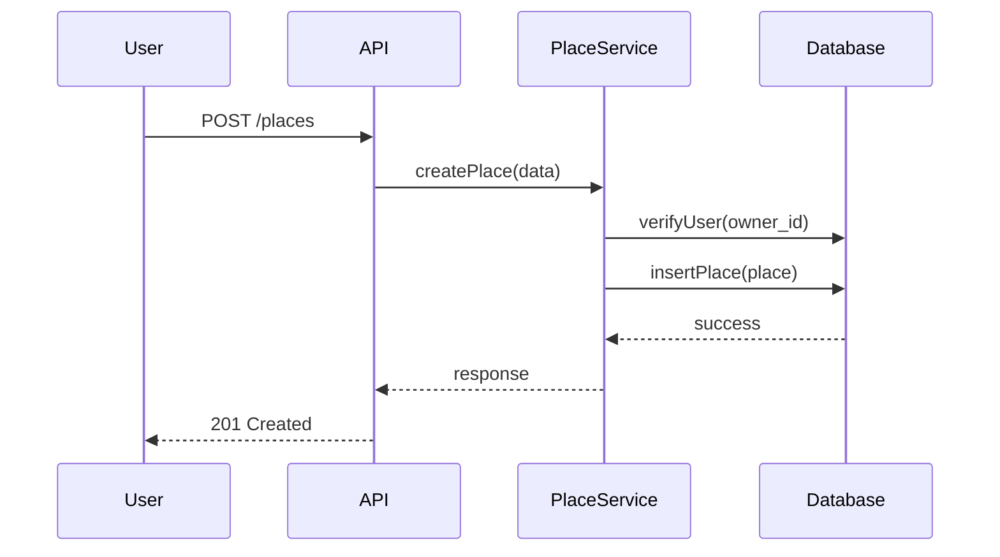
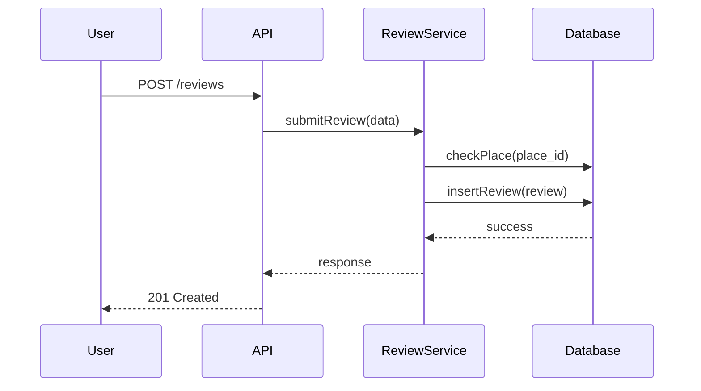
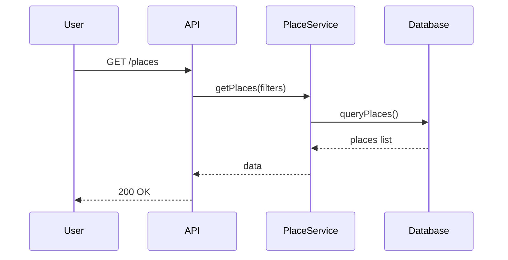

---

# 📘 HBnB Technical Documentation

---

## 1. Introduction

This document provides a comprehensive technical overview of the HBnB application architecture, design, and interaction flow. It serves as a blueprint to guide the implementation phase and ensure consistency across the system.

HBnB is a platform that allows users to:

* Register and manage accounts
* Create and manage place listings
* Submit reviews
* Browse available places

The document includes:

* High-level architecture (package diagram)
* Business logic (class diagram)
* API interaction flow (sequence diagrams)

---

## 2. High-Level Architecture

###  Overview

The system follows a **layered architecture** combined with a **Facade pattern**:

* **Presentation Layer** → API (entry point)
* **Business Logic Layer** → Services & Models
* **Persistence Layer** → Database

---

###  High-Level Package Diagram

---

###  Explanation

* **API** acts as a Facade — it hides internal complexity
* Services contain business rules
* Models represent core entities
* Database handles persistence

---

## 3. Business Logic Layer

###  Class Diagram

---

###  Explanation

#### 🔹 User

* Handles authentication and identity
* Can create places and reviews

#### 🔹 Place

* Represents listings
* Linked to a User (owner)

#### 🔹 Review

* Feedback left by users
* Linked to both Place and User

---

###  Design Decisions

* Separation of concerns → each entity has a clear responsibility
* Relationships reflect real-world logic
* Scalable structure for adding features (e.g., bookings)

---

## 4. API Interaction Flow

This section describes how different layers interact when processing API requests.

---

## 🔹 4.1 User Registration

###  Explanation

* User sends registration request
* Data validated in service layer
* Stored in database
* Response returned

---

## 🔹 4.2 Place Creation

###  Explanation

* User creates a listing
* Ownership is validated
* Place is saved

---

## 🔹 4.3 Review Submission

###  Explanation

* User submits review
* System checks if place exists
* Review is saved

---

## 🔹 4.4 Fetch Places

###  Explanation

* User requests data
* Filters applied
* Results returned

---

## 5. Overall Architecture Summary

###  Key Points

* **Layered Design**

  * Clear separation between API, logic, and data

* **Facade Pattern**

  * API simplifies interactions

* **Scalability**

  * Easy to extend services and models

* **Maintainability**

  * Clean structure reduces complexity

---

## 6. Conclusion

This document provides a structured and complete overview of the HBnB system design. It ensures that:

* All components are clearly defined
* Interactions between layers are well understood
* Developers can use it as a reference during implementation

---
