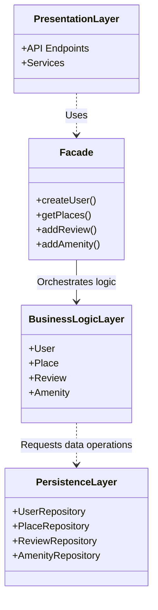
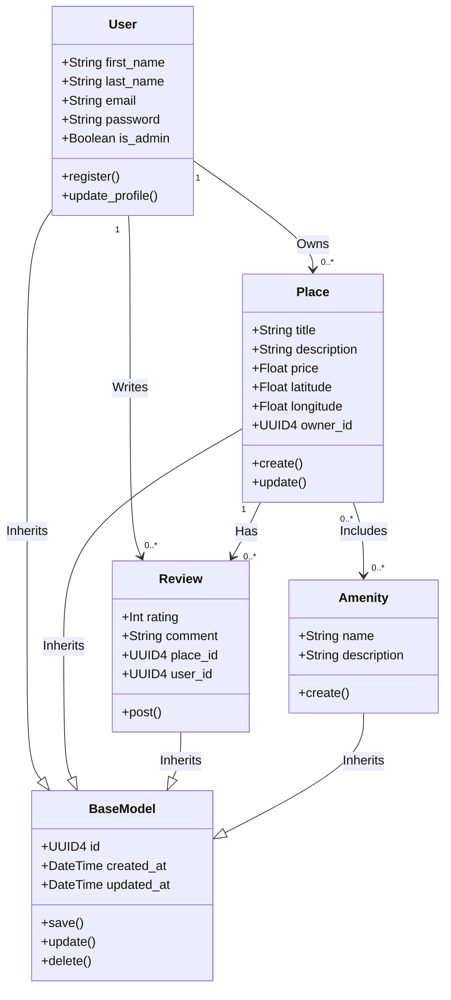
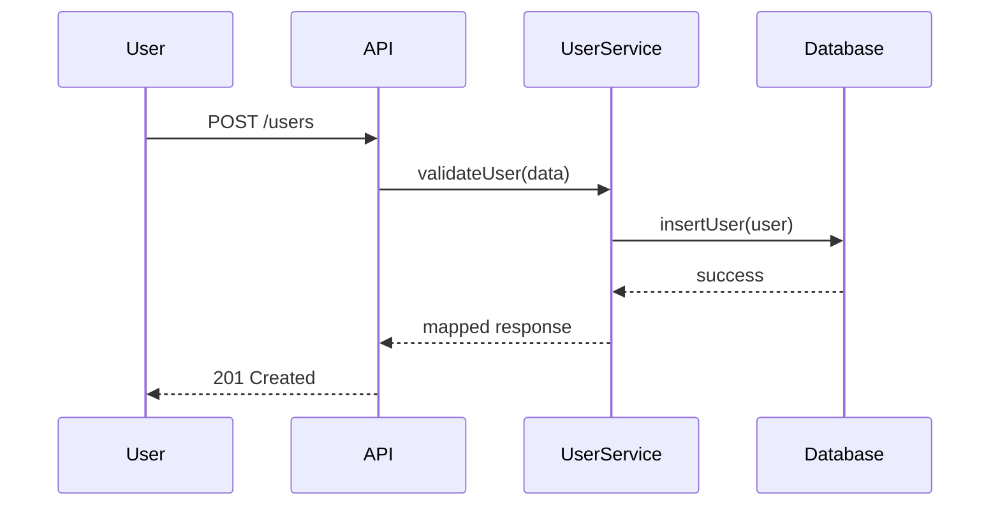
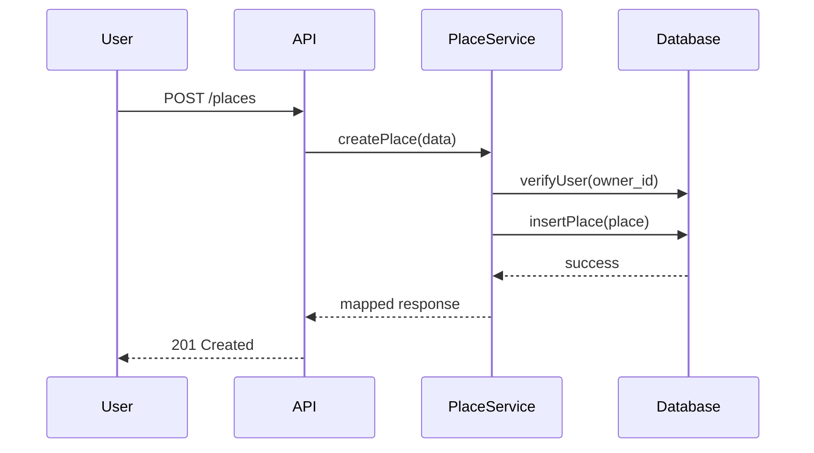
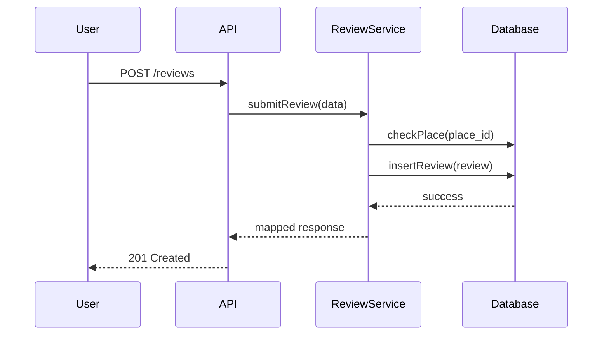
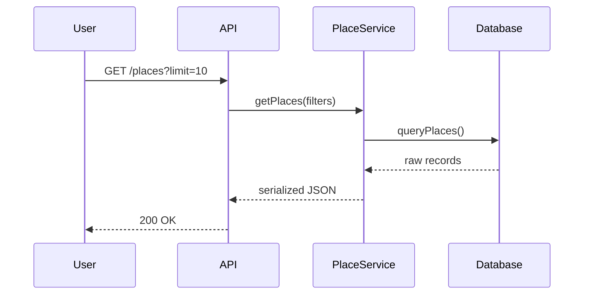

***

# HBnB Technical Documentation

This document outlines the architectural blueprint, core business logic, and data flow for the HBnB application. Designed as a scalable vacation rental platform, the system relies on strict separation of concerns to ensure that the codebase remains maintainable and extensible as new features are introduced.

## 1. High-Level Architecture

The application is structured around a **3-tier architecture**, effectively decoupling the user interface from data storage and processing. To manage complexity and prevent tight coupling between layers, the system implements the **Facade Design Pattern**.

* **Presentation Layer (API):** Serves as the entry point for the client. Its sole responsibility is to handle HTTP requests, parse JSON payloads, and return appropriate HTTP responses. It contains no business rules.
* **Business Logic Layer (Services & Models):** The "brain" of the application. It receives parsed data from the API through the Facade, enforces business rules (e.g., permissions, validation), and manipulates the domain models.
* **Persistence Layer (Repositories):** An abstraction layer over the database. It isolates database-specific queries from the business logic, allowing the underlying storage mechanism to be changed without rewriting the core application.

The Facade acts as a unified interface. The API does not need to know how the models interact; it simply calls a method like `createPlace()` on the Facade, which orchestrates the necessary internal operations.

## 2. Business Logic Layer & Domain Models

The domain model represents the real-world entities of the HBnB platform. 

To enforce the **DRY (Don't Repeat Yourself)** principle and maintain consistent auditing, all core entities inherit from a single `BaseModel`. This base class automatically assigns a universally unique identifier (`UUID4`) upon creation and manages lifecycle timestamps (`created_at`, `updated_at`). Using UUIDs ensures distributed uniqueness and prevents ID collision across the database.

**Entity Relationships:**
* **User & Place (1-to-Many):** A User can own multiple Places. The `Place` class maintains an `owner_id` as a foreign key reference, ensuring data integrity.
* **User, Place & Review:** The `Review` class acts as a transactional entity. It binds a `User` (the reviewer) to a `Place` (the subject), containing the rating and comment.
* **Place & Amenity (Many-to-Many):** Since multiple places can share the same amenities (e.g., Wi-Fi, Pool), they are linked through a many-to-many association represented by the `Includes` relationship.

## 3. API Interaction Flow

The interaction between the client and the server follows a strict sequence. Direct communication between the API and the Database is prohibited. Instead, the Service layer acts as a middleman. 

For instance, when a user attempts to create a listing or submit a review, the Service layer first validates the existence of the related entities (e.g., checking if the `owner_id` or `place_id` actually exists in the database) before executing the write operation. This prevents orphaned records and maintains database consistency.

### User Registration

### Place Creation

### Review Submission

### Fetch Places

