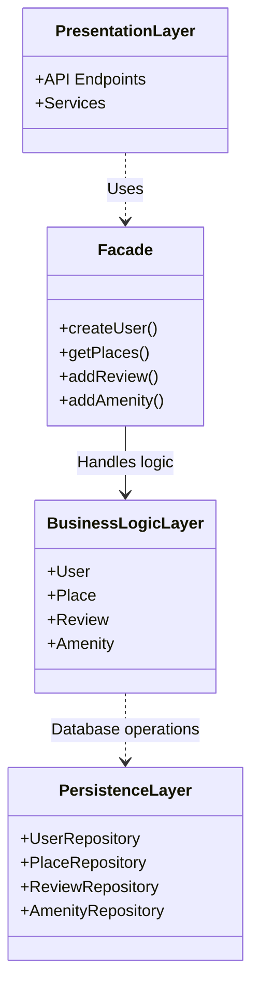
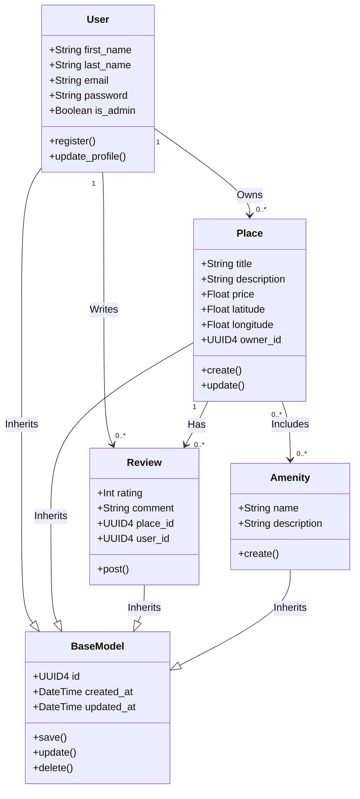
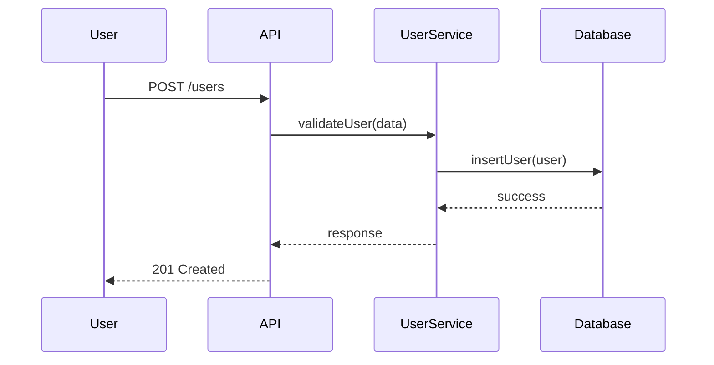
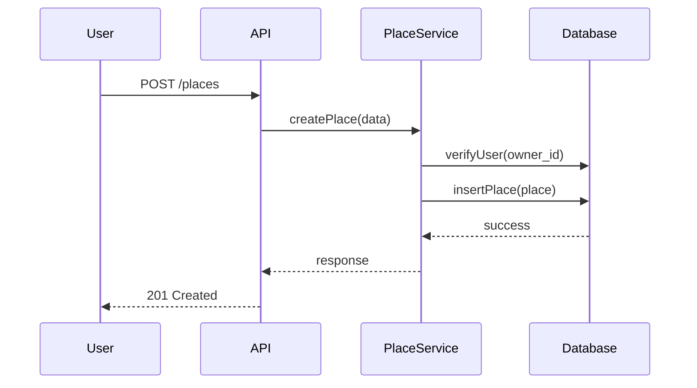
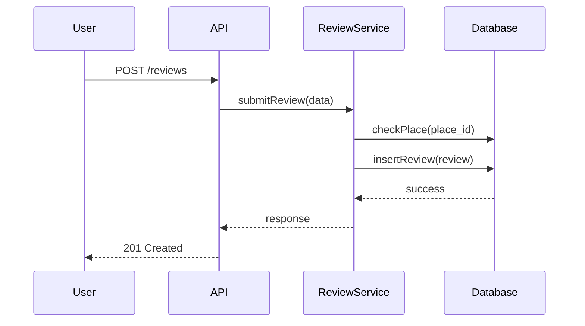
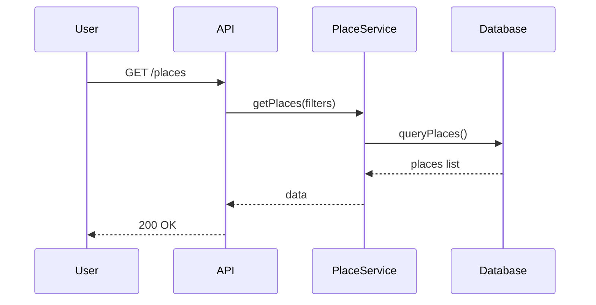

***

# HBnB Technical Documentation

This document outlines the architecture, internal logic, and data flow for the HBnB application. The system is designed as a simplified vacation rental platform, emphasizing clean separation of concerns and maintainability.

## 1. High-Level Architecture

The application is built on a standard 3-tier architecture pattern. To simplify interactions between the user-facing endpoints and the underlying logic, the Presentation Layer acts as a Facade. It receives HTTP requests and delegates the heavy lifting to the services, without exposing how the data is processed or stored.

## 2. Business Logic Layer

The core of the system revolves around four main entities. To avoid code duplication and ensure consistent auditing, all entities inherit from a single `BaseModel` that automatically handles unique identifiers (UUID4) and timestamps. 

A `User` can own multiple `Places` and write `Reviews`. A `Place` acts as the central resource: it belongs to an owner, contains a list of `Amenities` (many-to-many relationship), and receives `Reviews` from different users.

## 3. API Interaction Flow

The following sequence diagrams illustrate the step-by-step lifecycle of standard operations. In all cases, the API routes the payload to the appropriate Service class, which validates the business rules (e.g., verifying that a user exists before creating a place) before instructing the Database layer to persist the changes.

### User Registration

### Place Creation

### Review Submission

### Fetch Places

